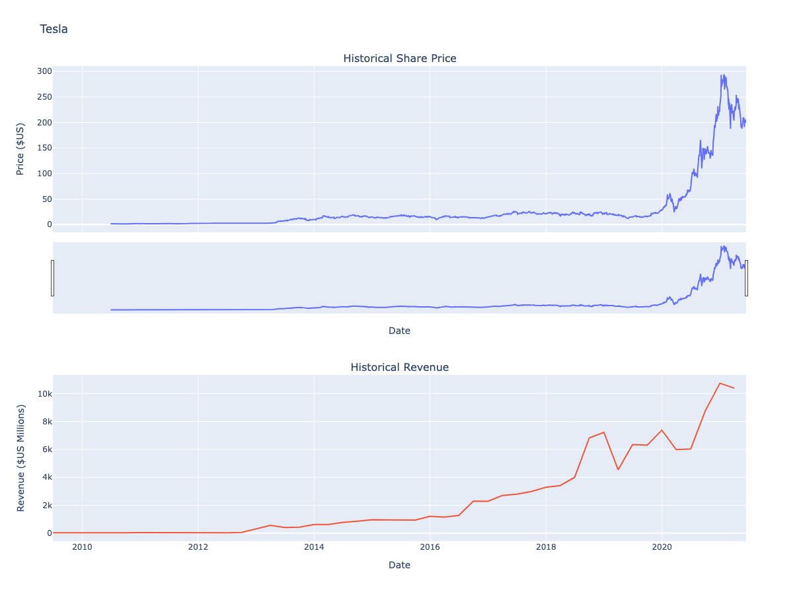

IBM Data Science Project
# 📊 Tesla & GameStop Stock and Revenue Analysis

## 🚀 Overview
This project analyzes **historical stock prices and revenue trends** of **Tesla (TSLA) and GameStop (GME)** using Python. The goal is to **visualize stock performance over time**, correlate it with company revenue, and identify key insights. 📈  

- ✅ **Extract stock price data** using `yfinance`
- ✅ **Web scrape revenue data** for Tesla and GameStop
- ✅ **Perform data cleaning & transformation**
- ✅ **Create interactive visualizations**
- ✅ **Analyze trends and patterns in stock movements**

---

## 📂 **Project Structure**
📁 Tesla_GameStop_Analysis/ │── 📜 README.md # Project documentation │── 📊 newplot.png # Tesla stock & revenue visualization │── 📊 newplot(1).png # GameStop stock & revenue visualization │── 📜 Final_Assignment.ipynb # Jupyter Notebook with code & analysis │── 📊 Data/ │ - Web Scraping url in notebook

---

## 🔍 **Data Sources**
- 📈 **Stock Price Data**: Extracted using `yfinance`
- 💰 **Revenue Data**: Web-scraped from financial sources

---

## 📊 **Visualizations**
### **Tesla Stock Price & Revenue Trends**


### **GameStop Stock Price & Revenue Trends**
.png)

---

## 📌 **Technologies Used**
| Category | Tools & Libraries |
|----------|-------------------|
| **Programming** | Python |
| **Data Extraction** | `yfinance`, `requests`, `BeautifulSoup` |
| **Data Manipulation** | `pandas`, `numpy` |
| **Data Visualization** | `matplotlib`, `seaborn`, `plotly` |
| **Jupyter Notebook** | `Google Colab`, `JupyterLab` |

---

## 🛠 **How to Run This Project**
### **1️⃣ Clone the Repository**
```bash
git clone https://github.com/your-username/tesla-gamestop-analysis.git
cd tesla-gamestop-analysis
```
2️⃣ Open the Jupyter Notebook
```bash
jupyter notebook Final_Assignment.ipynb
```
📈 Key Insights

🔹 Tesla's stock price shows exponential growth since 2019, correlated with revenue increases.

🔹 GameStop stock surged in 2021, despite no significant revenue growth.

🔹 Revenue growth does not always drive stock price movements—market sentiment plays a role.

🔹 Tesla’s revenue has consistently increased, driven by electric vehicle adoption.
